# Pipe Management Application

## Описание

Это веб приложение для управления трубами и пакетами труб. Оно позволяет добавлять, редактировать и удалять трубы и пакеты, а также управлять их связями.

## Установка

Для корректной работы приложения необходимо настроить подключение к базе данных PostgreSQL. Выполните следующий шаг:

### Настройка `appsettings.json`

В файле `appsettings.json`, который находится в корне проекта, необходимо указать параметры подключения к вашей базе данных. Найдите раздел `"ConnectionStrings"` и обновите его следующим образом:

```json
"ConnectionStrings": {
  "WebApiDatabase": "Host=localhost; Database=PipeManagement; Username=YourUsername; Password=YourPassword"
}
```

- **Host**: Адрес сервера базы данных. По умолчанию используется `localhost`, что подразумевает, что база данных работает на том же сервере, что и приложение.
- **Database**: Название вашей базы данных. По умолчанию используется `PipeManagement`.
- **Username**: Ваше имя пользователя для подключения к базе данных.
- **Password**: Ваш пароль для подключения к базе данных.

В данном примере замените `YourUsername` и `YourPassword`.

Далее откройте окно `Package Manager Console` и введите следующую команду:
```bash
Update-Database
```

В pgAdmin должна появиться созданная БД с таблицами заполненными тестовыми данными.
## Работа приложения
#### Главная страница
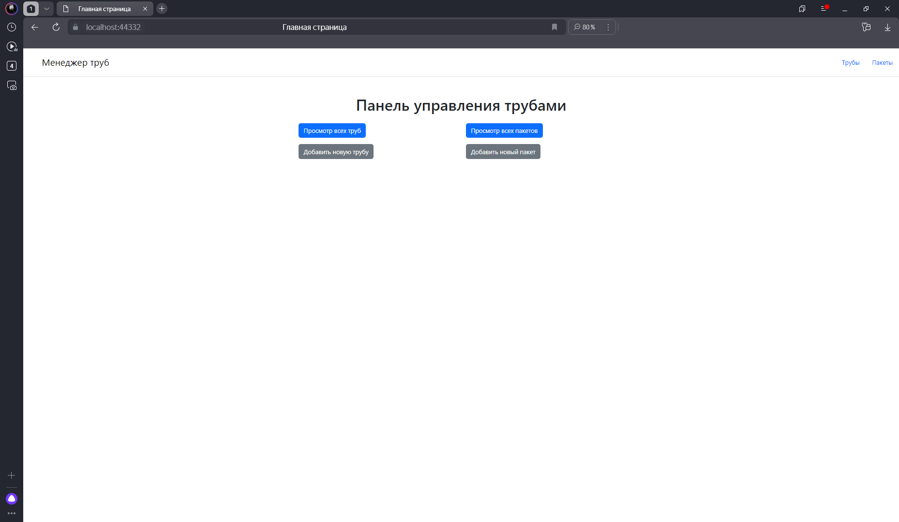

#### Список труб
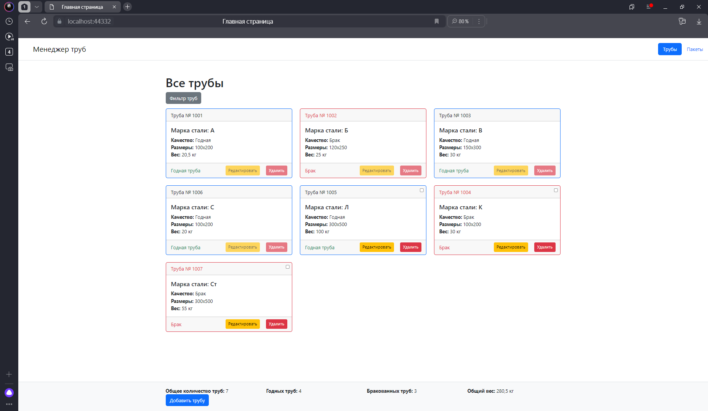

#### Окно фильтра для списка труб
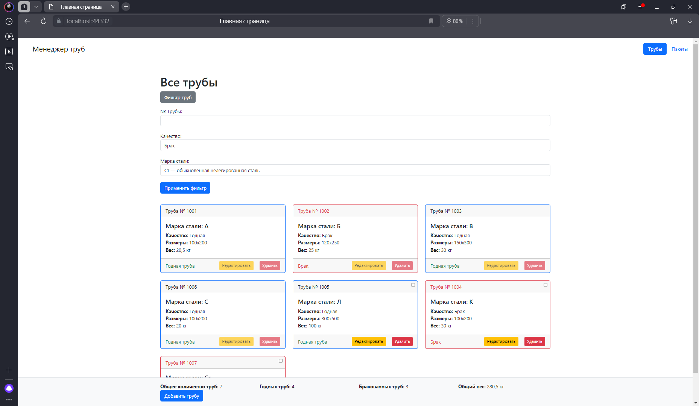

#### Примененный фильтр на странице списка труб
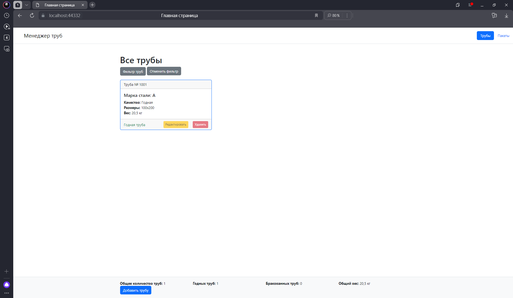

#### Страница добавления трубы
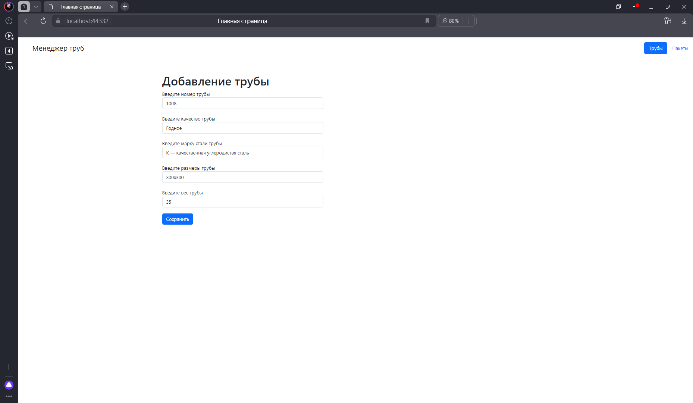

#### Страница удаления трубы
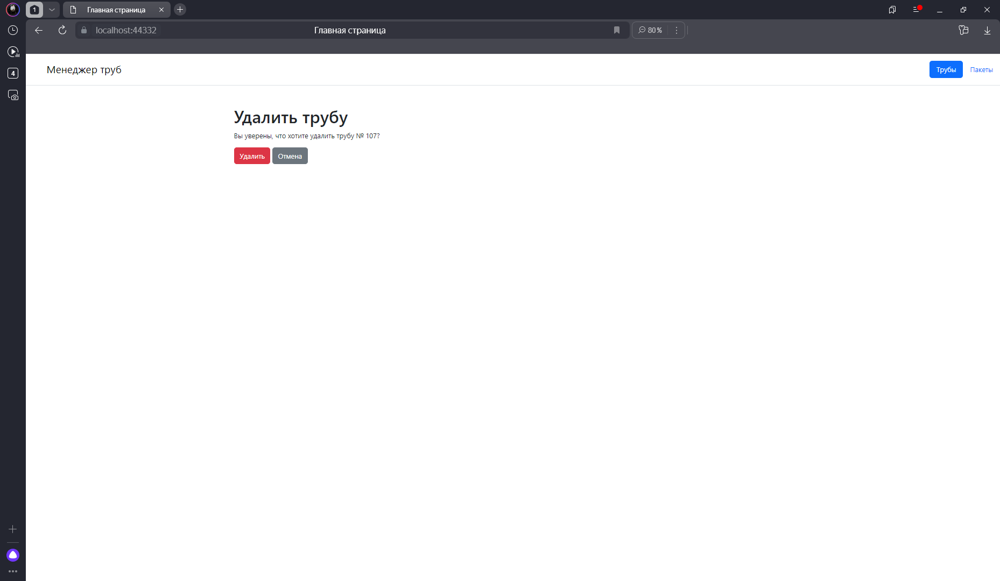

#### Страница редактирования трубы
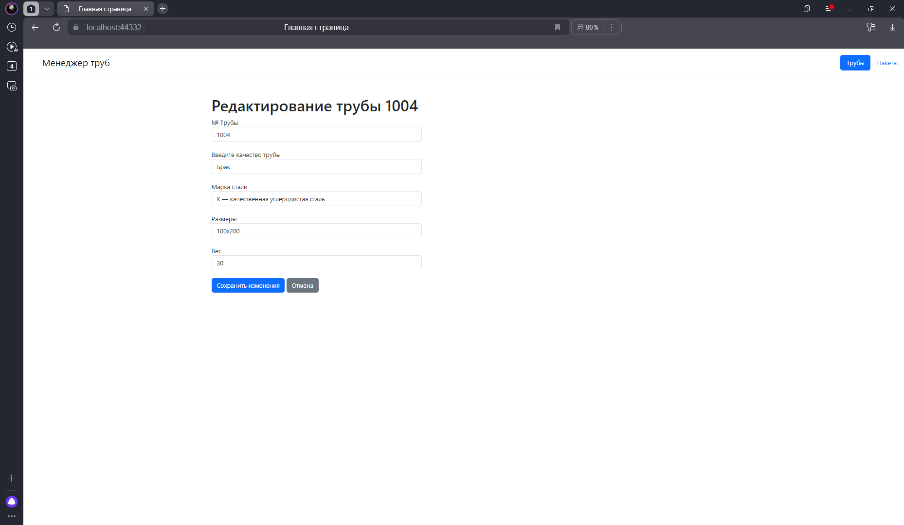

#### Список пакетов
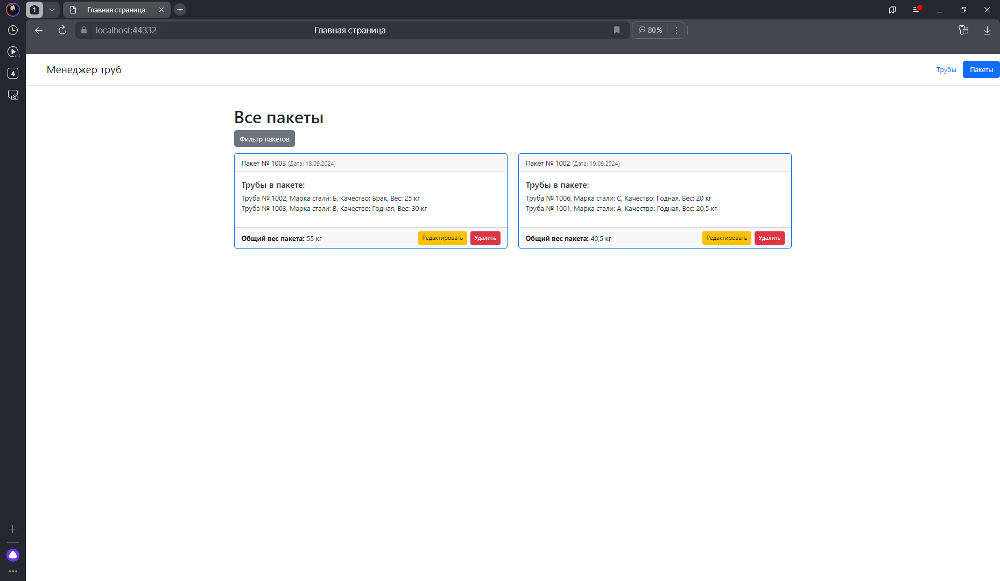

#### Окно фильтра для списка пакетов
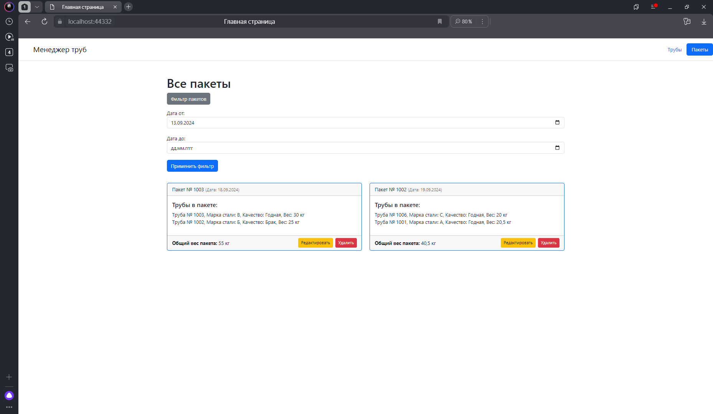

#### Страница добавления пакета
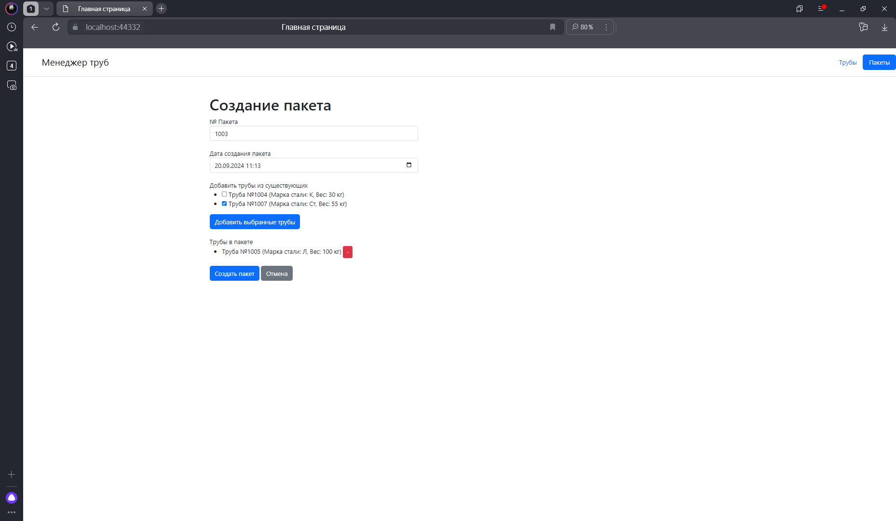

#### Страница удаления пакета
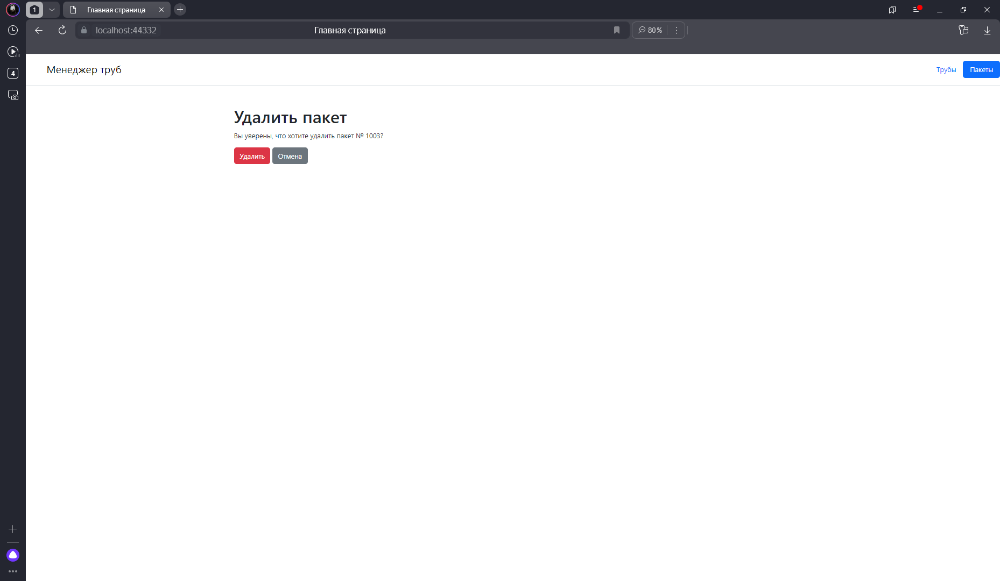

#### Страница редактирования пакета
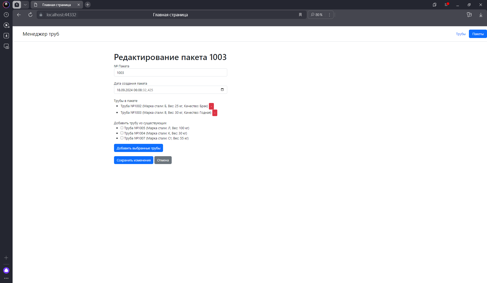
